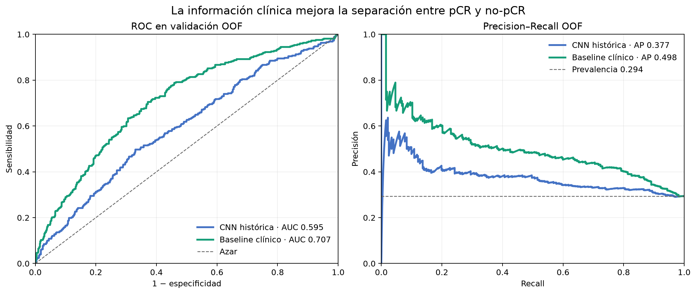
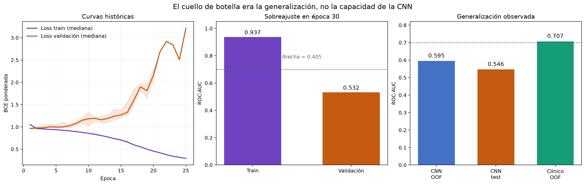
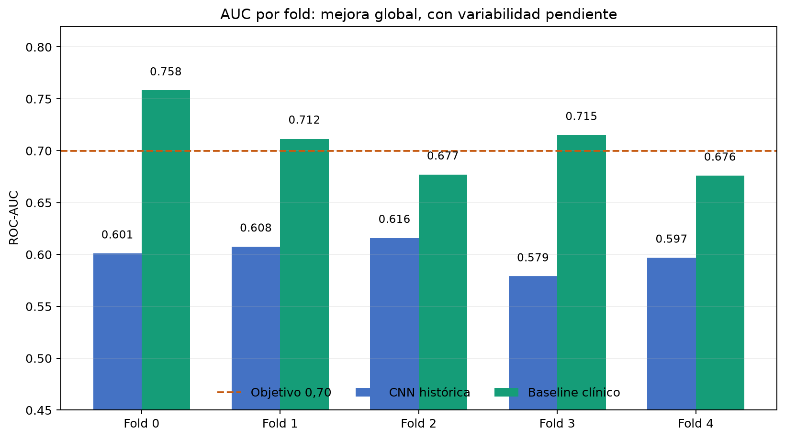
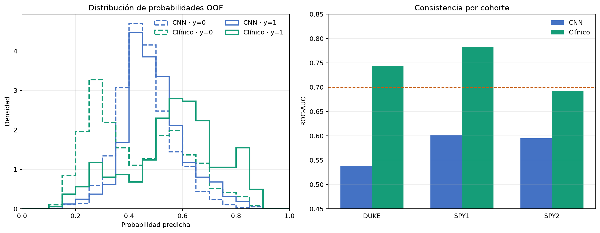
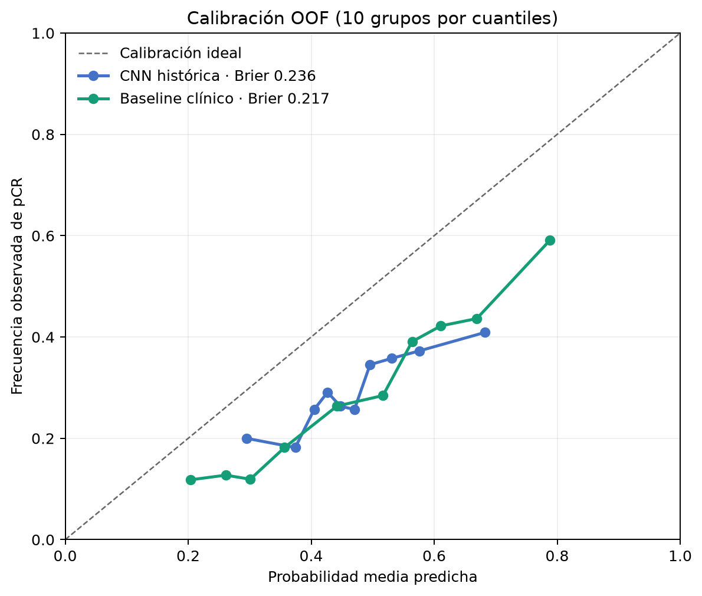

# Justificación cuantitativa de la mejora del modelo

Fecha: 07/10/2026. Unidad de evaluación: paciente.

## Conclusión ejecutiva

El cambio está justificado en **validación cruzada OOF**, no todavía en un test
privado nuevo. La CNN histórica obtiene AUC OOF **0.5945** y el
baseline clínico que inicializa el candidato multimodal obtiene **0.7071**:
una diferencia absoluta de **+0.1126**. El bootstrap pareado por paciente,
estratificado por fold y clase, sitúa el IC95% de la diferencia en
**[+0.0666, +0.1571]**. El intervalo no incluye cero.

La AP pasa de **0.3774** a **0.4977**
(IC95% pareado del cambio [+0.0608, +0.1756]). La prevalencia es
0.2935, por lo que ambos modelos superan el baseline aleatorio de AP,
pero la separación clínica es mayor.

| Evaluación | ROC-AUC | AP | Brier ↓ | Log-loss ↓ |
|---|---:|---:|---:|---:|
| CNN histórica · OOF | 0.5945 | 0.3774 | 0.2359 | 0.6655 |
| CNN histórica · test | 0.5462 | 0.3417 | 0.2390 | 0.6703 |
| Baseline clínico · OOF | 0.7071 | 0.4977 | 0.2170 | 0.6245 |

## Por qué era necesario cambiar

En el diagnóstico de época 30 la CNN alcanza AUC train **0.937**
y validación **0.532**, una brecha de
**0.405**. La loss de train sigue
bajando mientras la loss de validación permanece alta: es sobreajuste, no falta de
capacidad. Además, el modelo histórico seleccionado baja de AUC OOF
**0.595** a AUC test **0.546**.

## Comparación por fold

| Fold | CNN histórica | Baseline clínico | Diferencia |
|---:|---:|---:|---:|
| 0 | 0.601 | 0.758 | +0.157 |
| 1 | 0.608 | 0.712 | +0.104 |
| 2 | 0.616 | 0.677 | +0.061 |
| 3 | 0.579 | 0.715 | +0.136 |
| 4 | 0.597 | 0.676 | +0.079 |

La media de AUC de los cinco folds del baseline clínico es
**0.7076**. Dos folds permanecen por debajo de 0,70;
por eso el resultado es prometedor pero no demuestra todavía estabilidad perfecta.

## Comparación por cohorte

| Cohorte | Pacientes | CNN histórica | Baseline clínico | Diferencia |
|---|---:|---:|---:|---:|
| DUKE | 209 | 0.539 | 0.743 | +0.204 |
| SPY1 | 104 | 0.602 | 0.783 | +0.181 |
| SPY2 | 784 | 0.595 | 0.693 | +0.098 |

## Calibración

El AUC mide ordenación, no que una probabilidad de 0,70 signifique un 70% real.
El Brier OOF cambia de **0.2359** a **0.2170** y el ECE de
10 cuantiles de **0.1768** a
**0.1779**. La calibración deberá reajustarse por cross-fitting
después de entrenar el ensemble multimodal completo.

## Qué se puede y qué no se puede afirmar

- Sí: las cuatro variables clínicas aportan una mejora OOF grande, pareada y con
  IC95% positivo frente a las predicciones de la CNN histórica.
- Sí: el baseline supera 0,70 tanto en AUC media de folds como en AUC OOF agrupada.
- Sí: el candidato multimodal conserva ese baseline como checkpoint de época 0,
  por lo que el entrenamiento visual no puede reemplazarlo por un checkpoint peor.
- No: todavía no existe una estimación del candidato multimodal completo en el
  test privado del profesor.
- No: esta comparación OOF es interna y adaptativa; el conjunto de desarrollo ya
  se observó al escoger las variables y no sustituye una validación independiente.
- No: el AUC test histórico de 0.546 pertenece a la CNN anterior;
  no debe presentarse como test del modelo clínico.
- No: un AUC mayor de 0,70 por sí solo no demuestra calibración ni utilidad clínica.

## Reproducibilidad

Ejecutar `python 05_informe_mejora.py`. Se regeneran las predicciones clínicas
OOF, métricas, bootstrap, tablas y figuras sin cargar imágenes ni etiquetas nuevas
de test. Los ficheros numéricos quedan en esta misma carpeta.
