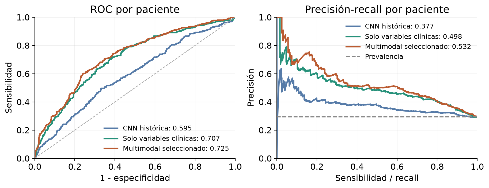
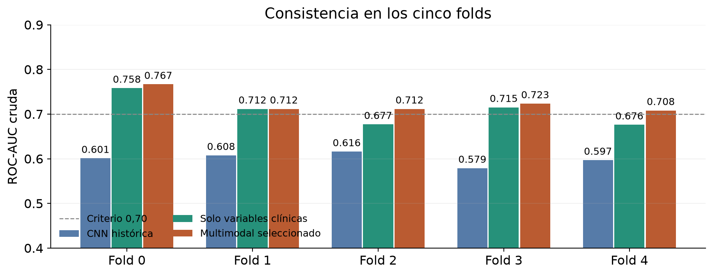
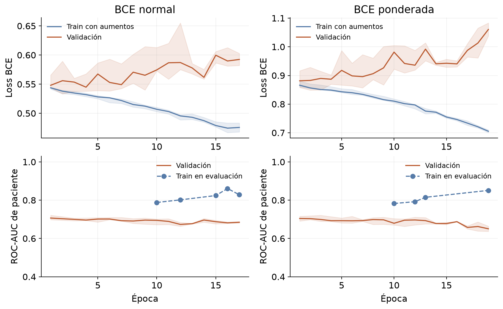
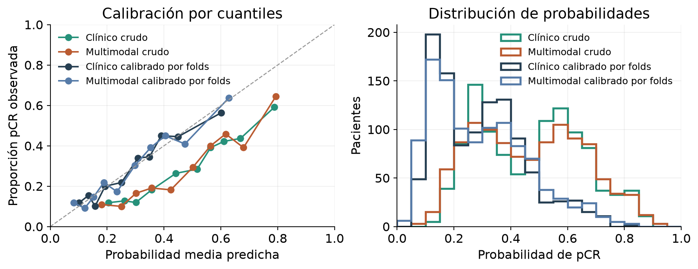

# Resultados del entrenamiento multimodal clínico

Fecha: 2026-10-07. Código de entrenamiento: `0b10e7c4f745716985a0950ea81e0b63e0fafb2d`.

## Valoración

Se completaron los 20 entrenamientos. El candidato seleccionado obtiene AUC media de folds 0.7243 y AUC OOF agrupada 0.7246, con IC95% descriptivo [0.6914, 0.7560], frente a 0.5945 de la CNN histórica.

Frente al modelo solo clínico, la diferencia de AUC media de folds es +0.0167, con IC95% descriptivo [+0.0044, +0.0285]. En AUC OOF agrupada, el cambio respecto a 0.7071 es +0.0175, con intervalo [+0.0059, +0.0292]. El intervalo descriptivo de la diferencia queda por encima de cero.

Cumple los tres requisitos cuantitativos definidos (AUC media, AUC agrupada y AP sobre prevalencia).

La selección de épocas y de combinación utiliza estas mismas pacientes de validación. La evaluación es interna y adaptativa: puede sobreestimar la mejora y requiere confirmación en pacientes nuevas.

Por indicación del usuario se asume que edad, volumen tumoral, HR y HER2 estarán disponibles en la prueba privada. Es un supuesto de trabajo, no una confirmación externa. El informe conserva el modelo histórico y no realiza evaluación nueva sobre test.

| Modelo | AUC media | AUC OOF | AP | Brier |
| --- | --- | --- | --- | --- |
| CNN histórica | 0.6001 | 0.5945 | 0.3774 | 0.2359 |
| Solo clínica | 0.7076 | 0.7071 | 0.4977 | 0.2170 |
| Multimodal elegido | 0.7243 | 0.7246 | 0.5316 | 0.2109 |

N = 1097 pacientes, 322 con pCR, prevalencia 0.2935. Se evalúan 10945 cortes exclusivamente del conjunto de desarrollo. Todas las AUC principales utilizan probabilidades crudas y paciente como unidad. La media de AUC por fold y la AUC agrupada son medidas distintas.

## Protocolo y ejecución

Configuración `pool_dropout_wd_clinical`; BCE normal y ponderada; semillas 42/2026; folds 0-4; máximo 46 épocas, mínimo 12, paciencia 10, lote 64 y cuatro workers, en RTX 3090 con CUDA. Se completaron 273 épocas físicas, con 48.3 minutos acumulados de entrenamiento/evaluación de épocas. La inicialización clínica, imputación y estandarización se ajustan solo en train de cada fold. El criterio de checkpoint es AUC de paciente de validación, incluyendo la época 0 clínica. El conjunto de validación también selecciona la pérdida y agregación; no es validación anidada.

## Seis combinaciones y selección

| BCE | Agregación | AUC media | AUC OOF | AUC mínima | AP | Elegido |
| --- | --- | --- | --- | --- | --- | --- |
| normal | media | 0.7242 | 0.7025 | 0.7051 | 0.4895 |  |
| normal | máximo | 0.7213 | 0.7031 | 0.7020 | 0.4957 |  |
| normal | mediana | 0.7232 | 0.7019 | 0.7042 | 0.4907 |  |
| ponderada | media | 0.7240 | 0.7244 | 0.7066 | 0.5318 |  |
| ponderada | máximo | 0.7235 | 0.7233 | 0.6981 | 0.5309 |  |
| ponderada | mediana | 0.7243 | 0.7246 | 0.7081 | 0.5316 | Sí |

Elegido: `pool_dropout_wd_clinical_weighted_median`. Se aplicó el orden de selección fijado: mayor AUC media de folds, después mayor AUC OOF y después menor Brier. La diferencia de AUC media entre ponderada/mediana y normal/media es solo 0,00012; esta elección no demuestra una superioridad firme de la pérdida o la agregación. El ensemble combina dos semillas para cada fold y contiene diez checkpoints para inferencia. Las predicciones OOF de cada paciente proceden solo de los modelos cuyo fold la deja fuera del aprendizaje; no se predice desarrollo con el ensemble de diez modelos para estimar OOF.

Con agregación media, la probabilidad media de cada fold varía entre 0.249 y 0.474 con BCE normal, y entre 0.448 y 0.499 con BCE ponderada. Una escala desigual puede empeorar la ordenación agrupada aunque cada fold ordene bien internamente. La época 0 parte de una logística equilibrada; BCE normal puede cambiar ese nivel de probabilidades, mientras los folds que conservan época 0 mantienen el inicial. Este es un diagnóstico descriptivo, no una atribución causal demostrada. No se reemplaza el requisito de AUC cruda por una AUC posterior a calibrar.

## Consistencia por fold

| Fold | N | CNN | Clínico | Multimodal | Delta clínico |
| --- | --- | --- | --- | --- | --- |
| 0 | 219 | 0.6010 | 0.7582 | 0.7667 | 0.0086 |
| 1 | 219 | 0.6076 | 0.7116 | 0.7116 | 0.0000 |
| 2 | 220 | 0.6160 | 0.6770 | 0.7117 | 0.0346 |
| 3 | 220 | 0.5789 | 0.7151 | 0.7234 | 0.0083 |
| 4 | 219 | 0.5969 | 0.6760 | 0.7081 | 0.0322 |

## Diferencias pareadas

| Referencia | Métrica | Delta | IC95 inferior | IC95 superior |
| --- | --- | --- | --- | --- |
| solo clínica | mean_fold_roc_auc | 0.0167 | 0.0044 | 0.0285 |
| solo clínica | roc_auc | 0.0175 | 0.0059 | 0.0292 |
| solo clínica | average_precision | 0.0339 | 0.0138 | 0.0533 |
| solo clínica | brier | -0.0061 | -0.0095 | -0.0028 |
| CNN histórica | mean_fold_roc_auc | 0.1242 | 0.0798 | 0.1649 |
| CNN histórica | roc_auc | 0.1301 | 0.0861 | 0.1707 |
| CNN histórica | average_precision | 0.1542 | 0.0955 | 0.2073 |
| CNN histórica | brier | -0.0250 | -0.0355 | -0.0146 |

Bootstrap de 4000 repeticiones, semilla 2026, muestreo de pacientes con reemplazo dentro de fold y clase. IC95% percentiles descriptivos, condicionados a las predicciones elegidas; no incorporan toda la incertidumbre del aprendizaje ni corrigen el sesgo de selección, dependencia entre entrenamientos o comparaciones adaptativas. Brier menor es favorable pero por sí solo no separa calibración y discriminación.

## Aprendizaje y aportación visual

| BCE | Semilla | Fold | Épocas | Mejor época | AUC elegida |
| --- | --- | --- | --- | --- | --- |
| normal | 2026 | 0 | 12 | 1 | 0.7624 |
| normal | 2026 | 1 | 12 | 0 | 0.7116 |
| normal | 2026 | 2 | 16 | 6 | 0.7104 |
| normal | 2026 | 3 | 12 | 2 | 0.7168 |
| normal | 2026 | 4 | 17 | 7 | 0.6989 |
| normal | 42 | 0 | 12 | 1 | 0.7661 |
| normal | 42 | 1 | 12 | 0 | 0.7116 |
| normal | 42 | 2 | 17 | 7 | 0.7133 |
| normal | 42 | 3 | 12 | 1 | 0.7247 |
| normal | 42 | 4 | 15 | 5 | 0.7085 |
| ponderada | 2026 | 0 | 13 | 3 | 0.7656 |
| ponderada | 2026 | 1 | 12 | 0 | 0.7116 |
| ponderada | 2026 | 2 | 12 | 1 | 0.7055 |
| ponderada | 2026 | 3 | 13 | 3 | 0.7250 |
| ponderada | 2026 | 4 | 12 | 2 | 0.7032 |
| ponderada | 42 | 0 | 12 | 1 | 0.7672 |
| ponderada | 42 | 1 | 12 | 0 | 0.7116 |
| ponderada | 42 | 2 | 19 | 9 | 0.7115 |
| ponderada | 42 | 3 | 12 | 0 | 0.7151 |
| ponderada | 42 | 4 | 19 | 9 | 0.7025 |

En 5 de 20 runs se conservó la época 0. En los diez checkpoints del ensemble elegido, 3 tienen todos los coeficientes visuales de la capa final exactamente a cero. Coeficientes visuales no nulos no demuestran por sí solos una aportación discriminativa independiente. La comparación con el baseline clínico es la referencia pertinente para valorar el entrenamiento visual.

La optimización conjunta también actualiza los coeficientes clínicos y usa BCE por corte, mientras la logística inicial se ajustó con una fila por paciente. La diferencia frente al baseline es del pipeline completo; sin una ablación equiparada no puede atribuirse exclusivamente a la imagen.

Las curvas muestran medianas y rango intercuartílico de los runs que llegan a cada época. El número de runs baja con la parada temprana: las últimas épocas no representan los veinte modelos. La loss train se calcula con aumentos y dropout; la de validación en evaluación. La AUC train de revisiones se calcula sin aumentos ni dropout.

Última revisión de cada run, sin confundirla con el checkpoint seleccionado:

| BCE | AUC train mediana | AUC validación mediana | Brecha mediana | Runs |
| --- | --- | --- | --- | --- |
| normal | 0.8206 | 0.6766 | 0.1473 | 10 |
| weighted | 0.8107 | 0.6862 | 0.1322 | 10 |

## Calibración y decisiones

El umbral 0,5 crudo produce F1 0.5530, sensibilidad 0.7050 y especificidad 0.6490. Con Platt ajustado en los otros cuatro folds y umbral fijo 0,5: Brier 0.1794, F1 0.3459, sensibilidad 0.2422, especificidad 0.9342. Este cross-fitting separa el calibrador de las etiquetas del fold evaluado, pero no elimina la selección previa de checkpoints o candidato.

| Modelo | Brier | F1 | Sensibilidad | Especificidad |
| --- | --- | --- | --- | --- |
| Multimodal crudo | 0.2109 | 0.5530 | 0.7050 | 0.6490 |
| Multimodal calibrado | 0.1794 | 0.3459 | 0.2422 | 0.9342 |
| Clínico calibrado | 0.1846 | 0.2810 | 0.1863 | 0.9419 |

La regresión logística inicial usa balanceo de clases. Sus probabilidades crudas no deben interpretarse como riesgo poblacional sin calibración. Comparar ambos modelos calibrados ayuda a separar ese efecto del cambio en discriminación.

El manifiesto de desarrollo tiene umbral Youden 0.354333, ajustado junto con Platt sobre todo OOF. Sus métricas son aparentes: no deben confundirse con una prueba independiente. La AUC de cada fold se conserva con Platt monótono; la AUC agrupada puede variar porque cada fold tiene una transformación distinta.

## Cohortes

| Cohorte | N | pCR | CNN | Clínico | Multimodal |
| --- | --- | --- | --- | --- | --- |
| duke | 209 | 44 | 0.5387 | 0.7431 | 0.7716 |
| spy1 | 104 | 26 | 0.6016 | 0.7830 | 0.7618 |
| spy2 | 784 | 252 | 0.5951 | 0.6927 | 0.7074 |

Análisis descriptivo en cohortes representadas en desarrollo. No equivale a una validación dejando una cohorte completa fuera del aprendizaje.

## Decisión y límites

Con el supuesto de disponibilidad de las cuatro variables clínicas, el multimodal es un candidato razonable para la prueba privada: cumple los objetivos de desarrollo y mejora modestamente al comparador clínico. La ganancia adicional necesita confirmación independiente; el modelo solo clínico sigue siendo una referencia importante por su menor complejidad. La disponibilidad se asume por indicación del usuario y no se presenta como una confirmación del profesorado. No se cambia el modelo final histórico. El test de la CNN anterior tiene AUC 0,546 según su informe congelado; esa cifra no pertenece al candidato multimodal. Las mejoras observadas aquí son de desarrollo interno y requieren corroboración independiente para afirmar generalización externa.

## Evidencia reproducible

Pasaron 19 tests y humo CUDA. Se comprobaron los 20 runs, cobertura y alineación de OOF, hashes de los diez checkpoints seleccionados y 88 archivos protegidos. El algoritmo bootstrap coincide con scikit-learn en casos con empates y duplicaciones. Imágenes de test cargadas por los runs: 0.

Entrenamiento: `resultados/04_entrenamiento/multimodal_clinico_20261007/entrenamiento.log`. Manifiesto: `resultados/04_entrenamiento/multimodal_clinico_20261007/comparacion/modelo_desarrollo.json`. SHA-256 del manifiesto: `534521e1aa41fadc4276949071c8c3bd6839d297659d6ef06e7ca5dca699f62a`.

Regeneración del análisis, sin entrenar: `.venv/bin/python -B 06_informe_multimodal.py`, manteniendo código y datos de esta ejecución. El PDF requiere ReportLab, ya instalado en el entorno utilizado; en otro entorno se puede instalar con `python -m pip install reportlab`. Tablas, predicciones y auditoría quedan en esta carpeta. El PDF está en `output/pdf/informe_multimodal_20261007.pdf`.

## Fuentes metodológicas

- [Validación cruzada y preprocesado dentro de train](https://scikit-learn.org/stable/modules/cross_validation.html)
- [Sesgo de selección y validación anidada](https://scikit-learn.org/stable/auto_examples/model_selection/plot_nested_cross_validation_iris.html)
- [Calibración de probabilidades](https://scikit-learn.org/stable/modules/calibration.html)
