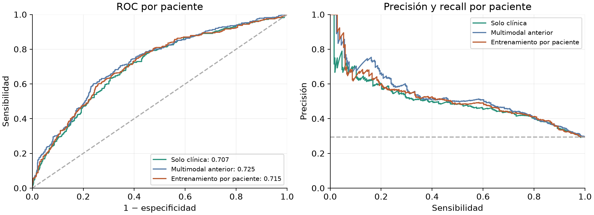
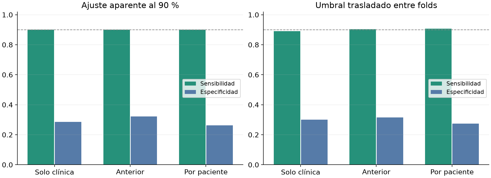
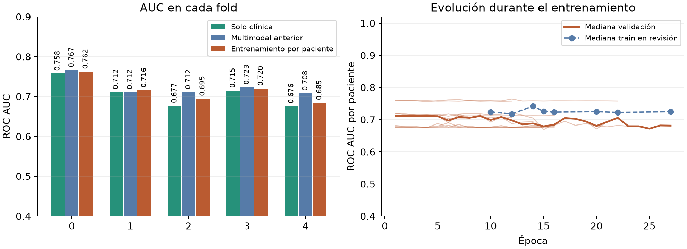

# Resultados del entrenamiento multimodal por paciente

La variante por paciente obtiene AUC OOF 0.7150, frente a 0.7246 del multimodal anterior. La diferencia es -0.0096; el intervalo descriptivo del 95 % es [-0.0191, +0.0005]. Mantener v002 como referencia. La nueva variante no mejora simultáneamente la AUC media, la AUC agrupada y la especificidad al mismo objetivo de sensibilidad; conservar sus resultados y checkpoints locales sin promoverla como sustituta.

## Protocolo y alcance

Se ejecutó únicamente `patient_level_clinical`, con BCE ponderada, semillas 42 y 2026 y cinco folds. Los diez runs usaron hasta 46 épocas, mínimo 12, paciencia 10, seis pacientes completos por lote, AdamW, dropout 0,35 y weight decay 0,001. El argumento `--lote 64` se usa para evaluación; el entrenamiento agrupa seis pacientes con todos sus cortes y tamaño variable. Las imágenes PRE, EARLY y LATE y las variables edad, volumen tumoral, HR y HER2 conservan la arquitectura de 551.921 parámetros del multimodal anterior.

La BCE conjunta usa la media de las probabilidades de los cortes de cada paciente y cada paciente pesa una vez por época. El peso de clase se calcula por paciente en el train de cada fold. La inicialización clínica y su preprocesado usan una fila por paciente dentro de ese train, igual que en el multimodal anterior. Se asume que las cuatro variables clínicas estarán disponibles en la prueba privada, según el criterio acordado para el proyecto.

La comparación cubre 1097 pacientes de desarrollo, 322 con pCR y 10 runs. No se cargaron imágenes del test ni se generaron nuevas predicciones de test. Las imputaciones y escalas se ajustan solo en train, como exige la [validación cruzada con preprocesado separado](https://scikit-learn.org/stable/modules/cross_validation.html).

## Discriminación en desarrollo

| Modelo | AUC media folds | AUC OOF | AP | Brier crudo |
| --- | --- | --- | --- | --- |
| Solo clínica | 0.7076 | 0.7071 | 0.4977 | 0.2170 |
| Multimodal anterior | 0.7243 | 0.7246 | 0.5316 | 0.2109 |
| Entrenamiento por paciente | 0.7155 | 0.7150 | 0.5157 | 0.2087 |

La media por fold cambia -0.0088. AP se compara con la prevalencia 0.2935. Las predicciones de los modelos anteriores se reutilizan; no se repitieron sus entrenamientos. Las pacientes, etiquetas, folds y cohortes están alineadas para la comparación pareada. En 2 de los cinco folds la nueva variante queda por debajo de AUC 0,70.



| fold | n | clinical_auc | previous_auc | new_auc |
| --- | --- | --- | --- | --- |
| 0 | 219 | 0.7582 | 0.7667 | 0.7625 |
| 1 | 219 | 0.7116 | 0.7116 | 0.7157 |
| 2 | 220 | 0.6770 | 0.7117 | 0.6946 |
| 3 | 220 | 0.7151 | 0.7234 | 0.7202 |
| 4 | 219 | 0.6760 | 0.7081 | 0.6847 |

## Sensibilidad y falsos positivos al mismo objetivo

Cada modelo se calibra y se elige su mayor especificidad con sensibilidad aparente de al menos el 90 %. Esta tabla usa las mismas etiquetas OOF para ajustar y medir el umbral, por lo que describe desarrollo. La decisión original de v002 usaba Youden y no es directamente comparable con la nueva regla del 90 %.

| model | sensitivity | specificity | precision | f1 | fn | fp |
| --- | --- | --- | --- | --- | --- | --- |
| Solo clínica | 0.9006 | 0.2865 | 0.3440 | 0.4979 | 32 | 553 |
| Multimodal anterior | 0.9006 | 0.3226 | 0.3558 | 0.5101 | 32 | 525 |
| Entrenamiento por paciente | 0.9006 | 0.2632 | 0.3368 | 0.4903 | 32 | 571 |

La especificidad de la nueva variante frente a la anterior cambia -0.0594 al aplicar el mismo objetivo. A igual sensibilidad aparente, la diferencia de falsos positivos del nuevo frente al anterior es +46. FN cuenta pacientes con pCR clasificadas como negativas; FP cuenta pacientes sin pCR clasificadas como positivas. Una sensibilidad alta obtenida moviendo el umbral debe juzgarse junto a su especificidad, como explica el [ajuste del umbral de decisión](https://scikit-learn.org/stable/modules/classification_threshold.html).

La siguiente comprobación ajusta calibración y umbral en cuatro folds OOF y los aplica al quinto. No usa directamente las etiquetas del fold destinatario para fijar su umbral, pero los pesos y la agregación ya fueron seleccionados con las validaciones originales; sigue sin ser una evaluación anidada completa.

| model | sensitivity | specificity | precision | f1 | fn | fp |
| --- | --- | --- | --- | --- | --- | --- |
| Solo clínica | 0.8913 | 0.3006 | 0.3462 | 0.4987 | 35 | 542 |
| Multimodal anterior | 0.9037 | 0.3148 | 0.3540 | 0.5087 | 31 | 531 |
| Entrenamiento por paciente | 0.9068 | 0.2735 | 0.3415 | 0.4962 | 30 | 563 |



## Entrenamiento y selección

Los diez runs completaron 172 épocas en 31.2 minutos de cómputo registrado y 35.9 minutos de tiempo total de ejecución, incluyendo inicializaciones, exportaciones y comparación. En 0 runs se conservó el baseline clínico de época cero; 0 de los diez pesos seleccionados mantienen la contribución visual final a cero. Un peso visual distinto de cero no demuestra por sí solo que las imágenes aporten una mejora generalizable.

La última revisión registra medianas AUC train 0.7250 y validación 0.6998, con brecha mediana 0.0399. La loss de train es BCE por paciente y la de validación se registra por corte; no se interpretan sus valores como una brecha homogénea.



La mediana de cada época usa solo los runs que alcanzan esa época. La parada temprana reduce el número de runs disponibles y cambia su composición, por lo que una caída de la mediana tardía no demuestra por sí sola que todos los modelos hayan empeorado. Las líneas individuales y la tabla de runs permiten distinguir ambas situaciones.

El comparador promedia primero las semillas por corte y valora media, máximo y mediana por paciente. Selecciona por AUC media de los cinco folds, seguida de AUC agrupada, Brier y preferencia por media en empate. La agregación elegida es `median`.

| aggregation | selected | roc_auc | average_precision | brier | mean_fold_roc_auc | min_fold_roc_auc |
| --- | --- | --- | --- | --- | --- | --- |
| mean | False | 0.7151 | 0.5158 | 0.2086 | 0.7154 | 0.6855 |
| max | False | 0.7136 | 0.5121 | 0.2111 | 0.7138 | 0.6841 |
| median | True | 0.7150 | 0.5157 | 0.2087 | 0.7155 | 0.6847 |

| seed | fold | epochs | best_epoch | best_auc | minutes | test_images_loaded | stop_reason | peak_vram_gib |
| --- | --- | --- | --- | --- | --- | --- | --- | --- |
| 2026 | 0 | 22 | 12 | 0.7644 | 3.9498 | 0 | early_stopping | 0.6080 |
| 2026 | 1 | 16 | 6 | 0.7176 | 2.8834 | 0 | early_stopping | 0.6080 |
| 2026 | 2 | 27 | 17 | 0.6949 | 4.9643 | 0 | early_stopping | 0.6080 |
| 2026 | 3 | 12 | 1 | 0.7188 | 2.1379 | 0 | early_stopping | 0.6080 |
| 2026 | 4 | 16 | 6 | 0.6821 | 2.8764 | 0 | early_stopping | 0.6080 |
| 42 | 0 | 12 | 1 | 0.7608 | 2.2442 | 0 | early_stopping | 0.6080 |
| 42 | 1 | 14 | 9 | 0.7151 | 2.5306 | 0 | early_stopping | 0.6080 |
| 42 | 2 | 16 | 6 | 0.6903 | 2.9165 | 0 | early_stopping | 0.6080 |
| 42 | 3 | 22 | 12 | 0.7210 | 3.9901 | 0 | early_stopping | 0.6080 |
| 42 | 4 | 15 | 5 | 0.6879 | 2.7172 | 0 | early_stopping | 0.6080 |

## Interpretación y conservación

Mantener v002 como referencia. La nueva variante no mejora simultáneamente la AUC media, la AUC agrupada y la especificidad al mismo objetivo de sensibilidad; conservar sus resultados y checkpoints locales sin promoverla como sustituta.

La selección de épocas y agregación sobre estas validaciones introduce optimismo. Los 4000 remuestreos pareados por paciente, estratificados por fold y etiqueta, describen diferencias entre predicciones fijas; no incluyen la variabilidad del entrenamiento ni el sesgo de selección. El intervalo de la diferencia AUC frente al anterior incluye cero, de modo que no establece una diferencia concluyente entre estas predicciones. El 90 % aparente no garantiza esa sensibilidad en pacientes nuevas. La [calibración de probabilidades](https://scikit-learn.org/stable/modules/calibration.html) y la selección del umbral necesitan confirmación independiente.

Los pesos y checkpoints de trabajo permanecen en `resultados/04_entrenamiento/patient_level_clinical_20261007/`. `modelo_desarrollo_origen.json` conserva los metadatos del manifiesto local y sus rutas originales; no incluye pesos ni constituye un paquete portátil. El historial publicado en `modelos/versiones/` conserva las versiones previas.

## Reproducibilidad

El commit de partida es `ab49a04493728fa1f0f49094c5c0d38ef893c061`. `ejecucion_fijada.json` conserva el protocolo previo, el entorno y los hashes protegidos; `evidencia/` conserva configuración, resumen, historia y OOF originales de cada run. `resumen.json`, `politicas_decision.csv`, `bootstrap_pareado.json` y `archivos_sha256.json` permiten comprobar las cifras.

Con los datos y los pesos locales disponibles, regenerar con:

```bash
.venv/bin/python -B -m cancer_mama.informe_paciente
```
